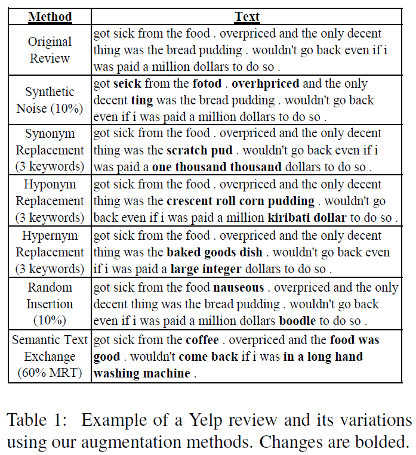

# GenAug: Data Augmentation for Finetuning Text Generators
Code for GenAug, presented in [*GenAug: Data Augmentation for Finetuning Text Generators*](https://aclanthology.org/2020.deelio-1.4/) published at EMNLP 2020 DeeLIO Workshop. You can cite it as follows:
```
@inproceedings{feng-etal-2020-genaug,
    title = "{G}en{A}ug: Data Augmentation for Finetuning Text Generators",
    author = "Feng, Steven Y. and Gangal, Varun and Kang, Dongyeop and Mitamura, Teruko and Hovy, Eduard",
    booktitle = "Proceedings of Deep Learning Inside Out (DeeLIO): The First Workshop on Knowledge Extraction and Integration for Deep Learning Architectures",
    month = nov, year = "2020", address = "Online",
    publisher = "Association for Computational Linguistics",
    url = "https://www.aclweb.org/anthology/2020.deelio-1.4",
    doi = "10.18653/v1/2020.deelio-1.4", pages = "29--42",
}
```
Authors: <a href="https://scholar.google.ca/citations?hl=en&user=zwiszZIAAAAJ">Steven Y. Feng</a>,
			  <a href="https://scholar.google.com/citations?user=rWZq2nQAAAAJ&hl=en">Varun Gangal</a>,
			  <a href="https://scholar.google.com/citations?user=fMKZOjwAAAAJ&hl=en">Dongyeop Kang</a>,
			  <a href="https://scholar.google.com/citations?user=gjsxBCkAAAAJ&hl=en">Teruko Mitamura</a>,
			  <a href="https://scholar.google.com/citations?user=PUFxrroAAAAJ&hl=en">Eduard Hovy</a>
              
Talk can be found [*here*](https://slideslive.com/38939727/genaug-data-augmentation-for-finetuning-text-generators). Slides and other resources can be found [*here*](https://styfeng.github.io/).

Note: inquiries should be directed to [*stevenyfeng@gmail.com*](mailto:stevenyfeng@gmail.com) or by opening an issue here.



## Required Resources
1. Stanford POS Tagger: https://nlp.stanford.edu/software/stanford-postagger-2018-10-16.zip
2. Stanford CoreNLP: http://nlp.stanford.edu/software/stanford-corenlp-full-2018-10-05.zip

## Pretrained/finetuned Models (on Yelp):
1. BERT Sentiment Regressor (Finetuned on YLR reviews with star ratings): https://drive.google.com/drive/folders/1JT07ZPxmMO9my5hH3MvJf8VmAlzuuUGf?usp=sharing
2. GPT-2 (Finetuned on 2 million Yelp reviews - for perplexity and SLOR evaluation): https://drive.google.com/drive/folders/1J3Jcw-qtdWxCYZV7LOnLjKVJZPXiFS2h?usp=sharing
3. SMERTI-Transformer (Trained on a subset of YLR): https://drive.google.com/drive/folders/1A-jyNp5So4lmv3ZtgKmwq7be8CoFtF_B?usp=sharing

## Data
- "stopwords.txt" contains a list of stopwords used.
- "yelp_train.txt", "yelp_val.txt", and "yelp_test.txt" contain the entire training, validation, and testing examples for YLR (both prompt and continuation portions).
- "yelp_train_0.5.txt" and "yelp_test_0.5.txt" contain first-half versions of the training and testing examples of YLR (prompt portions only).
- "SMERTI_chosen_REs.txt" contains the chosen 150 nouns as Replacement Entities for SMERTI inference.
- "SMERTI_train.csv" and "SMERTI_val.csv" contain the training and validation splits for SMERTI-Transformer, respectively.

## Code
- "augmentation_methods" folder contains code for the various GenAug augmentation methods (excluding SMERTI).
- "evaluation" folder contains code for the evaluation. Specifically, "get_unigram_distribution.py" is used for the rare_words (RWords) metric, and "evaluate_combined.py" contains code for SBLEU, UTR, TTR, and RWords. The "sentiment" sub-folder contains code for Sentiment Consistency evaluation [MORE DETAILS LATER].
- "finetuning_and_generation" folder contains scripts and code for finetuning GPT-2 models and generating outputs from GPT-2 models. Run the two .sh scripts to finetune and generate.
- "processing_and_setup" folder contains code to process and setup the data required for the experiments. "Continuation_Postprocessor.py" cleans the GPT-2 outputs (e.g. stripping trailing exclamation marks), "GenAug_Finetuning_Setup.ipynb" contains code to setup the final augmentation data for GPT-2 finetuning, "GenAug_SMERTI_Processing.ipynb" contains code to setup SMERTI training, validation, and inference data, and "GenAug_Yelp_Dataset_Processing.ipynb" contains code to process and setup the Yelp Reviews data for YLR and 2 million reviews subset for PPL and SLOR evaluation.

## SMERTI Augmentation Method Code
Code for the SMERTI augmentation method can be found in the "GenAug SMERTI-Transformer" folder at [*this repo*](https://github.com/styfeng/SMERTI).
This is the official repo for "SMERTI for Semantic Text Exchange" presented in [*Keep Calm and Switch On! Preserving Sentiment and Fluency in Semantic Text Exchange*](https://www.aclweb.org/anthology/D19-1272/) published at EMNLP-IJCNLP 2019.

Note: more details and example commands for all the code will be added at a later date.
